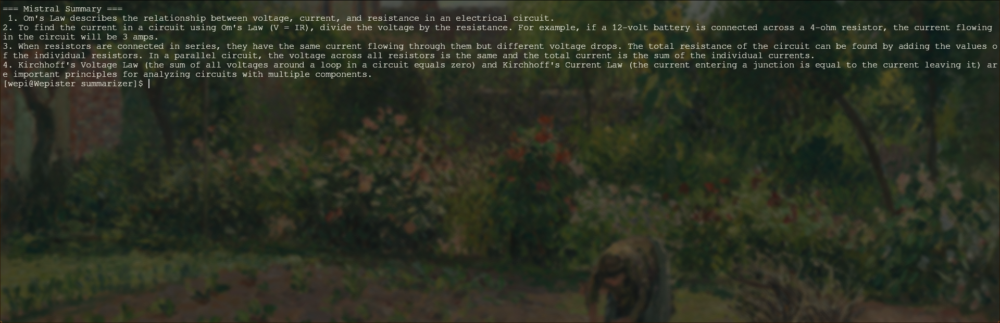
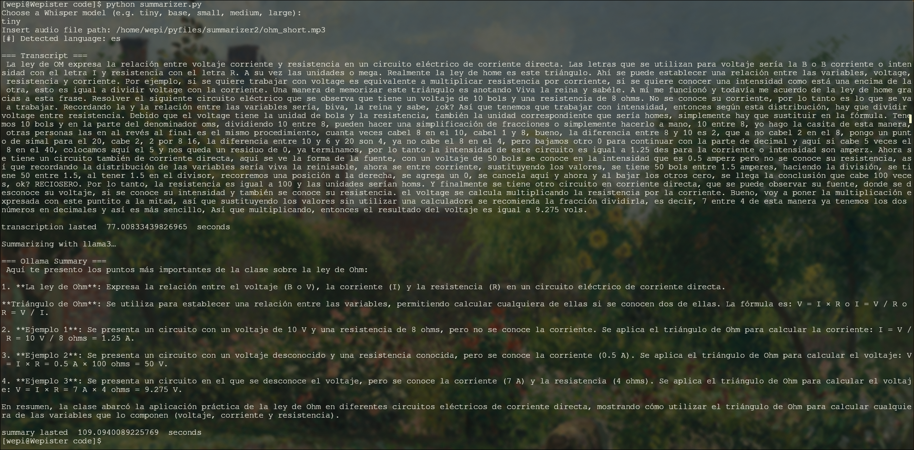

# Summarizer
A tool that summarizes audio into text, with a focus on academic use, anotate key points of a class, summarize really long lectures, or record yourself reading the material to then have it summarized.

## Updates I'd like to make
- Have it to ask questions to you about the material
- direct mic transcription
- phone compatibility

# Requirements 
- whisper (for managing audio)
- Ollama (for managing text)
- Torch

# Examples
- English
  
This example was made by feeding a video explaining ohm's law (https://youtu.be/_rSHqvjDksg?si=K-6AEUJeF_q6pKgO)

- Español
  
Este ejemplo fue hecho utilizando un video corto explicando la ley de ohm (https://youtu.be/izDKIyCPRWE)

# Installation

## Ollama
- linux
```
curl -fsSL https://ollama.com/install.sh | sh
```
- Windows & MacOS
visit Ollama's website (https://ollama.com/download/windows) / (https://ollama.com/download/mac)

## Whisper
```
sudo pacman -S python-openai-whisper
```
## Running summarizer
```
git clone https://github.com/aguscsc/Summarizer.git
cd code
python summarizer.py
```
# Usage
Run the model and you'll be prompted to choose a whisper model, you can visit openai's whisper repo for more information about the models (https://github.com/openai/whisper.git).
```
Choose a Whisper model (e.g. tiny, base, small, medium, large):
"YOUR CHOICE HERE"
Insert audio file path:
"YOUR AUDIO PATH HERE"
```
